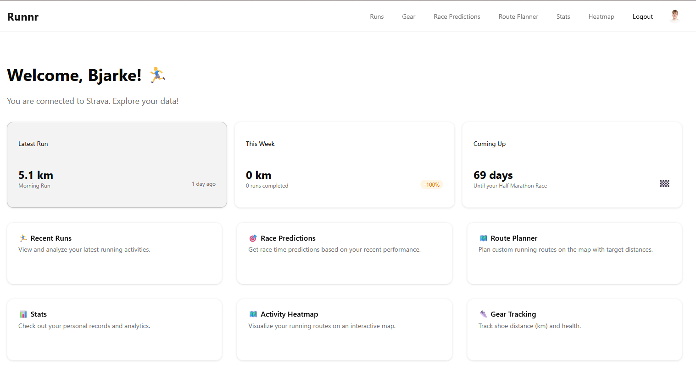

# Runnr

[](LICENSE) [](https://nextjs.org/) [](https://www.typescriptlang.org/)

Runnr is a Strava-connected running dashboard built with Next.js and TypeScript.

It helps you track training consistency, visualize routes, monitor gear, and generate race predictions from your run history.



## Quick Start

1. Clone and install:

   ```bash
   git clone https://github.com/bjarkeef/runnr.git
   cd runnr
   npm install
   ```

2. Copy environment file:

   ```powershell
   Copy-Item .env.example .env.local
   ```

   ```bash
   cp .env.example .env.local
   ```

3. Fill in required values in `.env.local`:
   - `DATABASE_URL`
   - `DIRECT_URL`
   - `STRAVA_CLIENT_ID`
   - `STRAVA_CLIENT_SECRET`
   - `STRAVA_REDIRECT_URI` (defaults to `http://localhost:3000/api/auth/callback`)

   Optional:
   - `OPENROUTESERVICE_API_KEY` (route planner)

4. Prepare database schema:

   ```bash
   npm run db:migrate
   ```

5. Start dev server:

   ```bash
   npm run dev
   ```

6. Open [http://localhost:3000](http://localhost:3000) and connect your Strava account.

Tip: if you only have one local PostgreSQL URL, use the same value for `DATABASE_URL` and `DIRECT_URL`.

## Docs

- Setup guide: [docs/getting-started.md](docs/getting-started.md)
- Database options (local, Docker, cloud): [docs/database-setup.md](docs/database-setup.md)
- Project structure and architecture: [docs/app-overview.md](docs/app-overview.md)
- Deployment: [docs/deployment.md](docs/deployment.md)

## Available Scripts

- `npm run dev` - run local development server
- `npm run build` - build production bundle
- `npm run start` - run production server
- `npm run lint` - run ESLint
- `npm run db:migrate` - apply Prisma migrations
- `npm run db:push` - push schema directly (alternative for local dev)
- `npm run db:studio` - open Prisma Studio

## License

MIT. See [LICENSE](LICENSE).
